# MixinKeys
Airbnb style DApp for Mixin Network
# Requirements
- Composer
- PHP >= 7.0
- Install MixinSDK by comand: composer require exinone/mixin-sdk-php -vvv
- Arduino UNO 
- ESP wi-fi module
- Bluetooth module 
- Mixin Messenger account
- Mobile app for bluetooth connection

# How to testing service
You can test live demo: (http://mixinkeys.ibisolutions.ru)
 To simplify the testing process we temporarily turned off the processing of data about houses and their owners. In first page you can see enter form:
 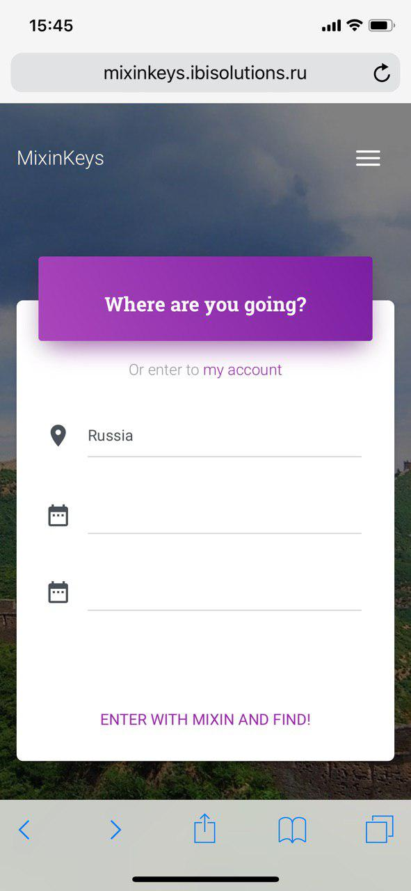</img> 
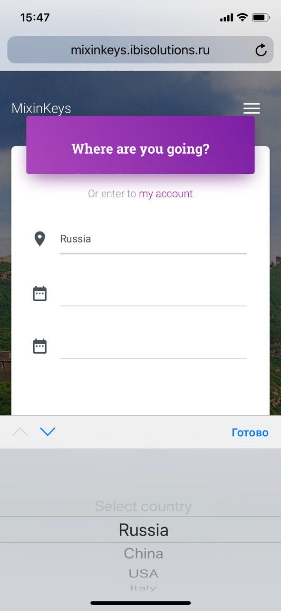</img> 
You can enter to your account (link "enter to my account") or fill form and enter for booking. 
You can choose country and date, but at the moment for demonstration we enabling all houses and they are the same in all countries. The owner of this houses - Mixin Messenger user Mi A2 Lite (37229842). 
 After that you must authenticate with Mixin Messenger and you will be redirect to booking page or to account page
 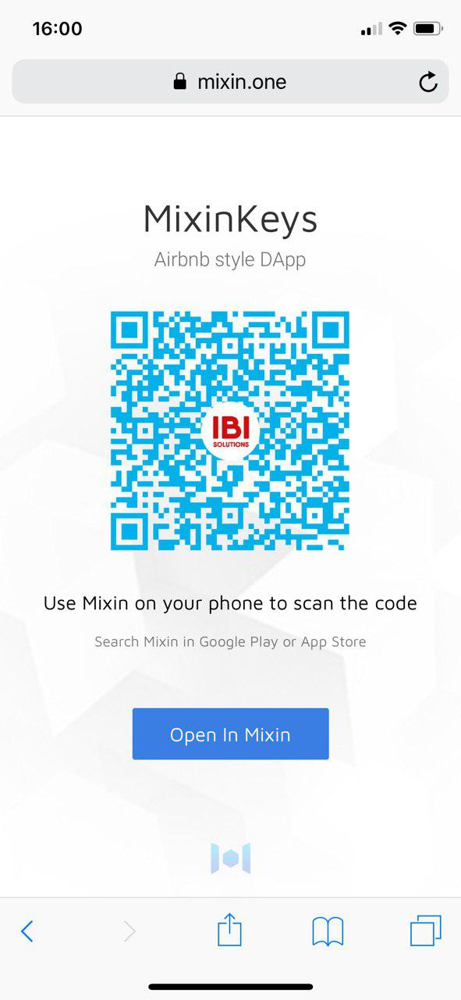</img>
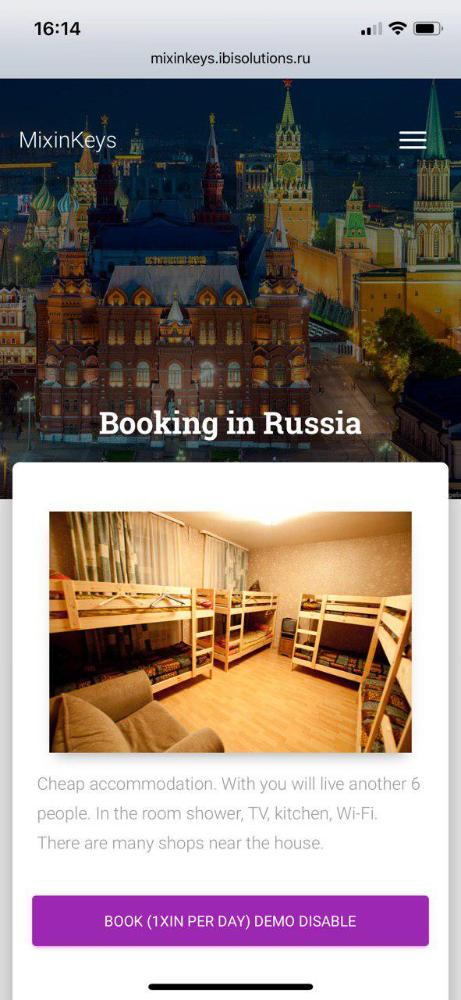</img>
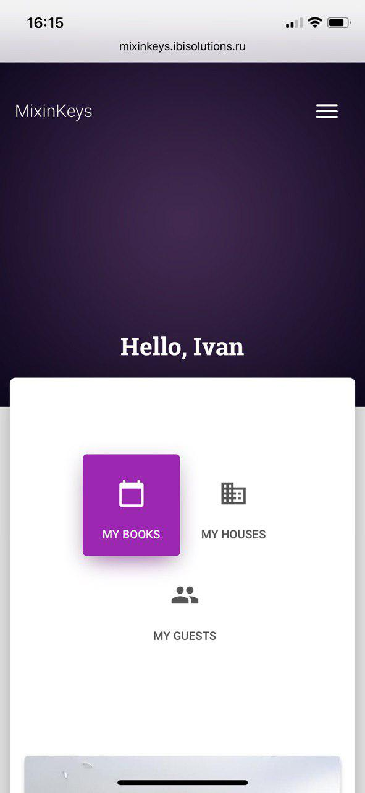</img> 
For booking you need press enabled button like this: 
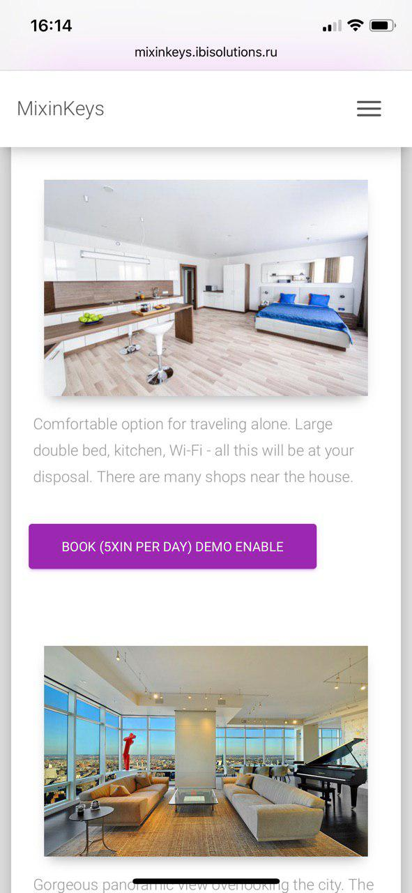</img> 
And you will be redirect to your account page for confirm and pay: 
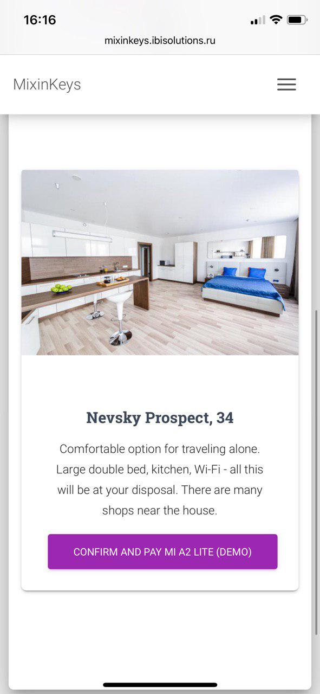</img>
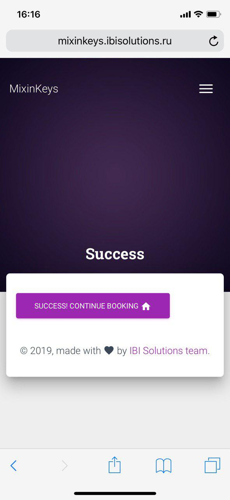</img> 
For generate transaction we use MixinSDK on PHP (https://github.com/ExinOne/mixin-sdk-php), so we have all functionality of Mixin Network, but now for test we can do only empty transactions, because we don't have permissions to get money by the testing period. 
Next, we can generate password (now it is default "11111111") for unlock house. You needn't to auth as Mi A2 Lite, for testing period we enable generation function for any user. You can "confirm and send code" by yourself and receive message in Mixin Messenger: 
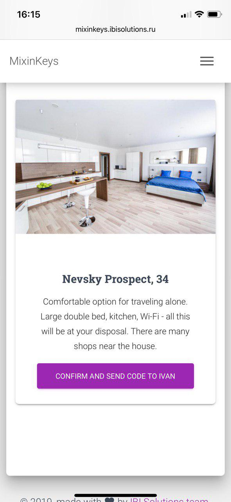</img>
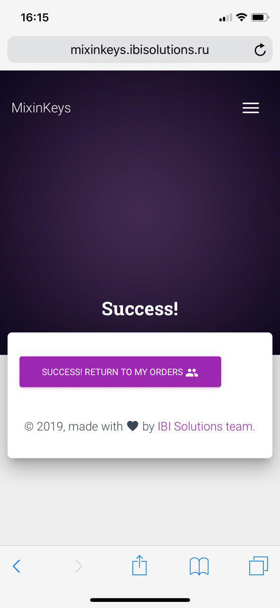</img>
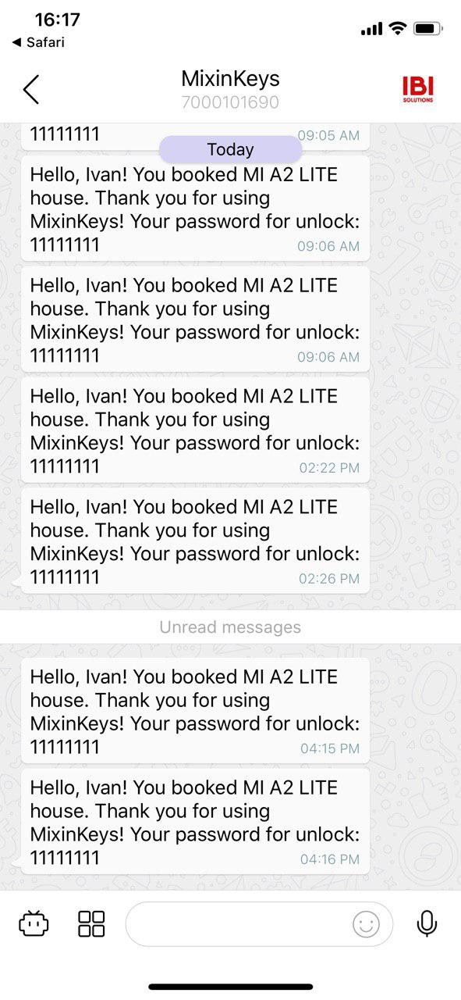</img> 
For testing smart lock you need arduino microcontroller (we used UNO), esp8266, bluetooth module and servo. You can use another controller, if you want. Live demo with controller you can see on youtube (https://youtu.be/TyIUbuKu_OY) and vimeo(https://vimeo.com/309406253).  
At first stage of development we focused more attention on integration service with Mixin Network (learn how to use Mixin API, develop concept of service for using Mixin API), integration service with IoT (develop simple prototype of SmartLock), develop simple website for demonstration and connect all these parts together. We didn't focuse on implementation full airbnb functionality (create/delete houses, filter enable houses by date and country, cancel of booking etc) because this implementation is much  simpler than what is described above, so we wanna fix it on next stage. 

# INTRODUCTION
Nowadays many people like to travel. During the trip, there is a need for rental housing. If you are traveling in a large company or for a long time, then choosing between the hotel and the apartment, the choice will fall on the apartment. At a price, the cost of daily rent of apartments is similar or cheaper than a hotel room of the appropriate level. The difference in price can reach 20-30%. In addition, at the disposal of a tourist or a business traveler who has arrived in the city for several days, there is a fully equipped kitchen where you can prepare lunch or dinner on your own. And when placed in a hotel, you will have to either leave a lot of money in a restaurant each time, or look for a decent cafe or restaurant. And it is not the fact that a decent institution will be nearby. The hotel will have to pay for each additional service - washing and ironing a shirt, taking care of shoes, etc. In the same apartment for rent, nobody will present an additional bill for using an iron, a washing machine or a brush for shoes.
Services helping to rent housing are profitable. Even despite such problems as the introduction in some cities, for example in New York and San Francisco, of legislative norms restricting the operation of these services, Airbnb's annual revenue in 2016 grew by 80%. 
Nowadays there are many services, which offers to rent an apartment. But there are a number of problems when renting apartments:
The solution of these problems is aimed at reducing the time of the landlord and
3. Confirmation of payment made and received
4. Minimizing action by the landlord
5. The ability to open the lock without transferring the usual key

# PROJECT DESCRIPTION
The proposed solution to these problems is to create a new service based on Mixin Network and IoT technologies.
This service will include:
1. Web-site on which housing can be selected;
2. DApp for the relationship between the landlord and the tenant;
3. Payment platform for faster and more secure money transfer;
4. Smart lock.
Now we will describe what means we will use for each item.

# Database Based Site
To store data on housing (location, employment for a certain time, cost, etc.) will be used a database that is linked to the site. The database will be stored in mysql, since this environment allows you to do all the necessary actions with databases, namely, to store, process and send requests.

# DApp based on Mixin Network
Mixin is a system created on the basis of the BFT-DAG network and connecting block chains that works with unlimited bandwidth. It can be easily installed on any mobile phone based on the Android OS by downloading from Google Play. The App Store also has a version for iOS gadget owners.
Tokenization of digital assets is one thing, and using them to solve real-world problems is quite another. These are the goals pursued by the developers of Mixin. Released under the platform, the XIN token is considered as a tool to combat problems such as the use, distribution and functionality of blockchain-based digital coins.
Mixin solves this problem with a mobile messenger, which allows you to easily, reliably and quickly transfer cryptocurrency between network users.
The list of main advantages of the platform includes:
Mixin uses the Signal protocol to control the messaging system. The protocol runs on the client, so the server acts only as a network of proxy messages. A powerful encryption system does not allow intercepting and decrypting such messages, even Mixin network nodes.
Each message is deleted from the network after the recipient has read it. All photos, videos and other attachments are also encrypted using a random AES key before uploading to a special cloud database. It can only be retrieved by the recipient through the AES key, which decrypts the information transmitted by the sender.
Based on the above, Mixin was chosen to create a new DApp. The project uses MixinSDK written on PHP language, so it means that all the functionality of Mixin is available in the project. 

# Smart lock based on Arduino, Wi-fi and Bluetooth module and servo
To eliminate the need for a personal meeting between the landlord and the tenant and to minimize the actions on the part of the landlord, a smart lock will be made. This lock has the following set of functions:
1. The ability to use a password to open the lock;
2. Ability to reprogram the lock to another password;
For communication between the tenant and the arduino the HC-06 bluetooth module
On the side of a managed device, such as an Arduino, this module looks like a normal serial interface. With the HC-06, you can control various devices directly from your smartphone by putting one of numerous control programs on your phone or tablet.
The operating voltage of this bluetooth module is 3.3 V, but its inputs are tolerant to 5 V, so it is compatible with all Arduino boards.
Arduino UNO was chosen because of its versatility, low cost, as well as the possibility of easy and rapid expansion of the functional. Bluetooth module HC-06 and wi-fi module esp8266 were chosen because they are easily integrated into the system with Arduino and the servo drive was chosen to create a lock opening mechanism.

# Smart lock variants
1. Arduino + bluetooth (landlord must program arduino by himself near the house)
2. Arduino + bluetooth + wi-fi (landlord can program arduino througth the website from everywhere - <b>we choose this method</b>)
3. Arduino + keypad (simply method to create smart lock, but not convenient and safety)
4. Another method, which you enjoy:) 

# Connecting all parts to one server
To work with a ready server, you will need to go to the site and select the housing you like. The site will transfer to mixin messenger, which, when paid, will create a transaction containing the password and time of arrival and departure, which will be communicated to the Arduino using the wi-fi module. Arduino will process the received data and program the lock. Upon arrival, the tenant will install any application that allows you to communicate with arduino Bluetooth and dial a password. This scheme is presented in the form of Figure 1.
This system allows you to reduce to an absolute minimum action by the landlord, and the use of mixin allows the tenant to feel more confident when transferring money.

# User interface and scenario.
User interface and script by the landlord.
1.	The landlord has an account on the mixin messenger.
2.	The landlord enters its housing database.
User interface and script by the tenant.
1.	The tenant gets a mixin messenger account.
2.	The tenant visits the site and selects the date and place of the booked accommodation.
3.	The tenant chooses the housing you like.
4.	The tenant transfers the money to the landlord and receives a password from the lock, which will be valid from the moment of his arrival until the time of the county. The password is generated by the system and sent automatically by the dapp through Mixin Messenger.
4.	The tenant transfers the money to the landlord and receives a password from the lock, which will be valid from the moment of his arrival until the time of the county. The password is generated by the system and sent automatically by the dapp through Mixin Messenger.
This scenario of the landlord shows that the landlord and tenant do not need a personal meeting to transfer the keys and it becomes possible to open the lock without transferring the key, which significantly reduces the necessary actions of the landlord to rent the property. Moreover, the landlord can reprogram his lock from anywhere in the world! Using Mixin, we reduce the time for the transfer of funds, as well as solve the problem of confirming the payment made and received.

# CONCLUSION
Despite the fact that every year more and more cities introduce legislative acts restricting the work of such services, the removal of apartments is gaining great popularity. More and more people prefer apartments to replace hotels. Therefore, rental services bring more profit to their creators. But such people can become even more if problems with the transfer of funds and the transfer of the key are solved. Thus solving these problems you can achieve a good profit. In the course of this project, all these tasks were solved, namely:
1. Creating a new service for renting housing
2. Reducing the time of transfer of funds
3. Confirmation of payment made and received
4. Minimizing action by the landlord
5. The ability to open the lock without transferring the usual key
This service can be expanded for hotels, cars and other. 
